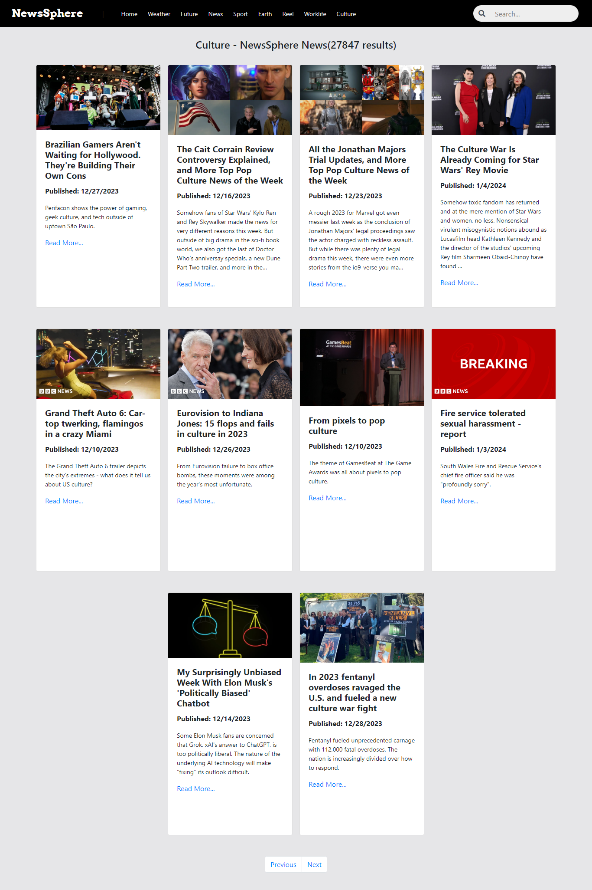

# NewsSphere

NewsSphere is a web-based news aggregator application that provides users with up-to-date news from various sources. It's designed to offer a seamless and intuitive experience for users to stay informed about current events, trends, and breaking news.

### Demo

## Features

- **News Categories:** Explore news articles across multiple categories such as General, Weather, Sports, Future, Earth, Culture, and more.
- **Search Functionality:** Search for specific news articles using keywords.
- **Pagination:** Navigate through multiple pages of news articles.
- **Responsive Design:** The app is designed to work seamlessly on desktop and mobile devices.

## Usage

Once the app is running, you can:

- Browse news articles by clicking on different categories in the navigation bar.
- Use the search bar to find articles related to specific keywords.
- Click on the article title or "Read More" to view the full article on the source website.

## Technologies Used

- HTML5
- CSS3 (Bootstrap for styling)
- JavaScript (with Node.js and Express.js for backend)
- External APIs for fetching news data
